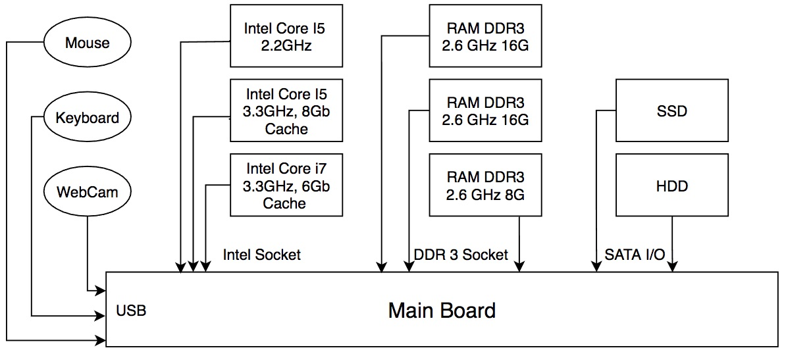

# Dependency Injection

Dependency Injection, viết tắt là DI, dịch thô là "tiêm vào sự phụ thuộc". Nghe rất là khù khoằm còn bản chất như sau:

1. Các ứng dụng được cấu tạo bởi nhiều thành phần khác nhau
2. Khi xây dựng nên ứng dụng này, các thành phần có thể được tuỳ biến, thay đổi miễn sao thoả mãn yêu cầu của ứng dụng
3. Việc tuỳ biến và thay đổi nhưng đảm bảo yêu cầu chính là kỹ thuật Dependency Injection.

Kỹ thuật DI có mặt ở khắp mọi nơi, đặc biệt trong ngành sản xuất máy móc, thiết bị và cả xây dựng.

Ví dụ 1: Lắp ráp máy tính để bàn. Ban đầu tôi mua một main board. Sau đó tôi mua bổ xung CPU, RAM, card đồ hoạ, ổ cứng hoặc ổ SSD.
Nhờ mainboard và các thành phần thiết kế tuân thủ theo các chuẩn interface standard (CPU socket, DDR3/DDR4, SATA, USB...) mà tôi có thể tuỳ chọn các thành phần khi lắp ráp.
Một số thiết bị ngoại vi như web cam, máy in, bảng vẽ có thể trang bị sau tuỳ vào yêu cầu của chủ nhân (lazy loading)


Ví dụ 2: Nhà máy Compal Đài Loan, chuyên gia công sản xuất OEM laptop cho Dell, HP và Compaq. Khi Compal nhận được yêu cầu từ các Dell, HP và Compaq, họ sẽ báo giá lại chi phí sản xuất, thời gian giao hàng. Khi hợp đồng được ký kết, Compal tiếp tục đặt hàng linh kiện từ: CPU <- Intel, AMD, Hard Disk <-- Western Digital, Seagate, Corner, Fujisu, Hitachi, RAM <-- Samsung, Hyunix, Intel...

Công việc của Compal thực chất họ đang tiêm (inject) các thành phần phụ thuộc (dependency) vào sản phẩm cuối cùng. Dây truyền của Compal ảo diệu đến mức hôm nay họ có thể sản xuất laptop cho HP, nhưng ngay ngày mai, đổi đi một số linh kiện họ có thể sản xuất laptop cho Dell.

Ví dụ 3: Khi bán chung cư, công ty bán cho khách hàng nhiều lựa chọn:
- Căn hộ xây thô có đủ đường điện, nước, khách hàng tự làm nốt
- Căn hộ đã có sàn gạch hoặc gàn gỗ
- Căn hộ đầy đủ sàn gỗ, tủ bếp, tủ quần áo, điều hoà, đèn...

Tuy vào túi tiền của khách hàng, công ty sẽ bố trí thợ hoàn thiện rồi bàn giao. Quá trình hoàn thiện bổ xung từng thành phần nội thất, linh kiện cho căn hộ chính là Dependency Injection.

Sau khi làm chủ căn hộ, khách hàng vẫn có thể mua thêm đồ đạc hay bỏ đi nhưng nội thất họ không thích.

Bạn thấy đó, Dependency Injection có gì khó hiểu đâu nhỉ mà người ta cứ làm nó trở nên rất kinh khủng. Tôi giải thích cho mẹ tôi 3 phút mẹ tôi đã hiểu DI !

## Tại sao DI lại được đề cao trong Java nhưng lại không ở Python, JavaScript?

Python, JavaScript là những ngôn ngữ lập trình không kiểm tra kiểu chặt chẽ do đó việc lập trình kết nối các thành phần khá đơn giản, linh hoạt.

Ngược lại Java, C++ kiểm tra kiểu rất chặt chẽ, có thể nói là cứng nhắc. Nhưng các lập trình viên lại muốn phần mềm của họ được cấu hình linh hoạt. Java có mấy công nghệ rất hay ho sau đây giúp DI dễ dàng hơn:
1. [Reflection](https://www.oracle.com/technical-resources/articles/java/javareflection.html): giúp phần mềm tự tìm hiểu kiểu, phương thức của các thành phần khác. Trước khi lắp ghép các thành phần phải tìm hiểu nhau cái đã.
2. Hướng đối tượng: Interface, Abstract Class, Compose over Inheritance
3. Generics: chung thuật toán cho nhiều kiểu
4. Chiến thuật [Lazy loading](https://www.geeksforgeeks.org/lazy-loading-design-pattern/): khi nào cần mới tìm class phù hợp rồi khởi tạo, nạp vào sử dụng


## Danh sách các bài thực hành minh hoạ cho DI

Dưới đây tôi tạo ra các ví dụ minh hoạ cho DI sử dụng thư viện Spring Boot. Các web framework trước Spring Boot cũng áp dụng DI, nhưng dùng quá nhiều XML khiến cho lập trình viên vừa phải viết file XML vừa file viết mã Java. Cách dùng XML gây nhiều phiền toái, lỗi. Nên tôi chỉ giới thiệu cách DI sử dụng cú pháp annotation của Java. Các bạn có thể xem luôn bài số 5: Ba phương pháp DI khác nhau. Còn nếu muốn tìm hiểu từ từ thì cứ đi từ bài số 1-2-3-4-5-6-7

- [Bài 1](01component/demobean/) : Component, @Autowire, tính chất Singleton
- [Bài 2](02ApplicationContextAware/demobean/): Truy xuất đến singleton ApplicationContext bằng cách nào?
- [Bài 3](03ComponentScan/demobean/): Cơ chế quét Class được đánh đấu  bởi ```@Component``` và các phương thức được đánh dấu ```@Bean```
- [Bài 4](04DependencyInjection/demobean/): Cơ chế cấu hình động thành phần.
- [Bài 5](05DifferentWaysDI/demobean/): Ba phương pháp DI khác nhau
- [Bài 6](06LazyPrototype/demobean/): Tạo đối tượng bean mới mỗi lần nó được gọi đến
- [Bài 7](07TopCarServiceComponent): @Service component
- [Bài tập](homework)

## Tham khảo
Các bạn nên tham khảo 2 bài viết rất dễ hiểu của giảng viên Nam Loda.me tại đây
1. [Spring Boot 1: Hướng dẫn Component và Autowired](https://techmaster.vn/posts/36165/spring-boot-1-huong-dan-component-va-autowired)
2. [Spring Boot 2: Autowired - Primary - Qualifier](https://techmaster.vn/posts/36167/spring-boot-2-autowired-primary-qualifier)