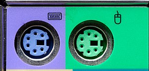

# Interface Segregation Principle

Uncle Bob phát biểu như thế này
> A client should never be forced to implement an interface that it doesn’t use, or clients shouldn’t be forced to depend on methods they do not use.

Có thể dịch như sau
> Khách hàng (hiểu là các class) không nên bị buộc phải tuân thủ (implement) một giao diện lập trình mà nó không bao giờ dùng đến Hoặc nó cũng không được ép phải phụ thuộc vào phương thức mà nó không dùng.

## Một số ví dụ đời thường để Interface Segregation Principle

### 1. Cổng giao tiếp PS/2

Trong nhiều main board máy tính những năm 2004-2016 chúng ta vẫn thấy có cả cổng giao tiếp PS/2 và USB. Chuẩn USB mới hơn, nhưng nhà sản xuất vẫn giữ lại cổng giao tiếp PS/2 cổ điển để tương thích với chuột, bàn phím cũ. Tuy nhiên người dùng không bị bắt buộc phải dùng cổng PS/2.

Tương tự nhà sản xuất main board có thể hỗ trợ vài chuẩn khe cắm PCI. Việc dùng hay không lại tuỳ thuộc vào người dùng.

### 2. Trợ lý ảo tư vấn sức khoẻ
Chúng ta xây dựng một dịch vụ tư vấn sức khoẻ. Người dùng có thể tiếp cận dịch vụ này bằng nhiều cách:
1. Sử dụng web site, gõ thông tin bằng bàn phím, chuột
2. Sử dụng ứng dụng di động, bấm, chạm sử dụng slider để nhập cân nặng, chiều cao.
3. Sử dụng một thiết bị đo chiều cao, cân nặng đặt ở các trung tâm thương mại, và có thể giao tiếp với người dùng có nhận dạng giọng nói và tạo tiếng nói nhân tạo.

Có nhiều cách để giao tiếp với người dùng (different user interface). Mỗi một thiết bị chỉ thực hiện một interface cụ thể, không thất thiết phải đủ tất cả các interface.

### 3. Mô hình hoá hoạt động của các loại động vật.
Các loại động vật chia ra nhiều loại:
máu nóng vs máu lạnh
động vật có vú vs không vú
trên cạn vs dưới nước
không có cánh vs có cánh
đẻ trứng, ấp trứng vs đẻ con

Nếu chúng ta tạo ra một class hay một interface mô tả tất cả các hoạt động của động vật: di chuyển, ăn, thở, bơi, bay, nhảy, bò, chèo...
[Animal.java](BulkyInheritance/Animal.java)

Mỗi loài vật cụ thể kế thừa từ class hay interface trên chỉ có thể làm được một số hoạt động, nhưng hoạt động còn lại nếu thực hiện thì bất hợp lý, mà không thực hiện thì báo lỗi biên dịch.

Ví dụ [Fish.java](BulkyInheritance/Fish.java) có phương thức fly. 99% các loại cá không thể bay, do đó phải ném ra ngoại lệ [UnimplementedMethodException](BulkyInheritance/UnimplementedMethodException.java) khi gọi phương thức fly

```java
@Override
public void fly() throws UnimplementedMethodException {
  throw new UnimplementedMethodException("Fish cannot fly");
}
```

Theo nguyên lý Interface Segregation Principle, ta sẽ chỉ giữ lại ở [abstract class Animal](InterfaceSegeration/Animal.java) những phương thức chung nhất có ở mọi loài vật

```java
public abstract class Animal {
  protected String name;
  public abstract void eat();
  public abstract void breath();
}
```

Những hoạt động (phương thức) còn sẽ gom vào các interface để các loại vật cụ thể tuân thủ vừa đủ, không thừa, không thiếu.

Ví dụ như [Snake.java](InterfaceSegeration/Snake.java) có ```crawl```
```java
public class Snake extends Animal implements ReptileActivity {

  @Override
  public void breath() {
  }

  @Override
  public void eat() {
  }

  @Override
  public void crawl() {
  }
  
}
```

Với [Tiger.java](InterfaceSegeration/Tiger.java) có ```run``` và ```walk```
```java
public class Tiger extends Animal implements MoveActivity {

  @Override
  public void breath() {
  }

  @Override
  public void eat() {
  }

  @Override
  public void jump() {
  }

  @Override
  public void run() {
  }

  @Override
  public void walk() {
  }
  
}
```

# Bài tập
Hãy porting [code ví dụ về nguyên lý Interface Segregation viết bằng Python sang Java](https://dev.to/naomidennis/introduction-to-the-interface-separation-principle-3bmj).


[Cheat sheet so sánh ngang hàng giữa Python và Java](https://programming-idioms.org/cheatsheet/Python/Java)
