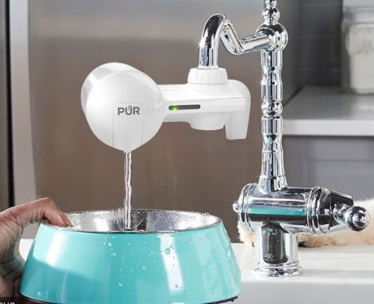

## Nguyên lý Liskov

Nếu bạn đã đọc đâu đó về nguyên lý Liskov bạn sẽ thấy họ giải thích khá phức tạp với nhiều code mẫu. Tôi sẽ bắt đầu bằng ví dụ vòi nước. Công dụng căn bản của vòi nước là đóng và mở nước từ đường ống cung cấp.

Các công ty luôn sáng tạo cải tiến vòi nước

Nếu thay vòi nước mới vào, mà phải lại toàn bộ đường ống cấp nước thì khách hàng sẽ phải cân nhắc lại trước khi mua. Do đó bộ phận ren vòi nước bắt vào đường ống cần phải giữ nguyên không đổi, tính năng căn bản đóng - mở cần phải dễ dùng với mọi người.
 