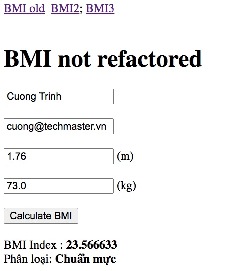
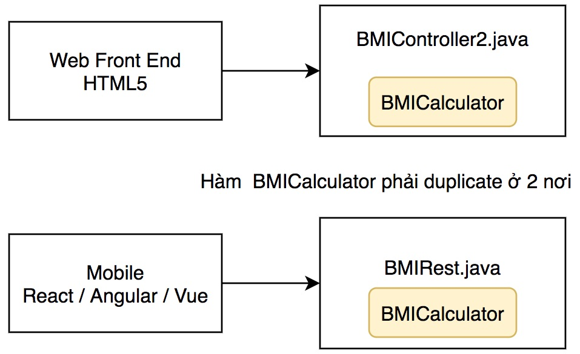
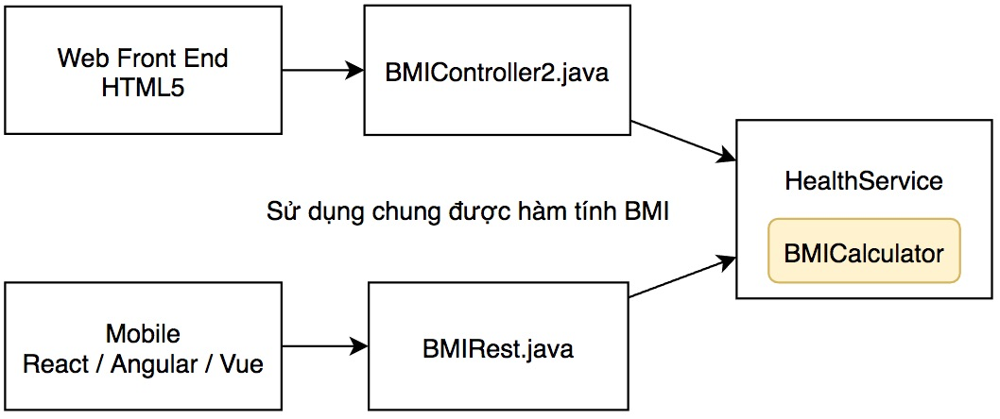
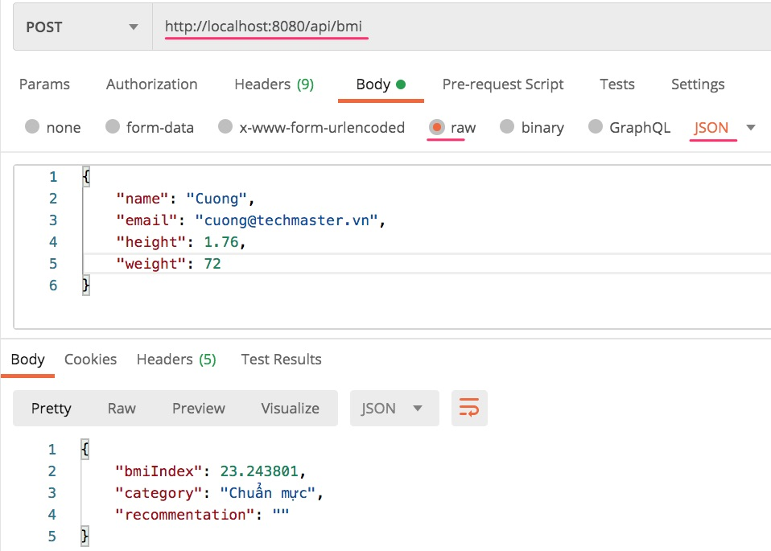
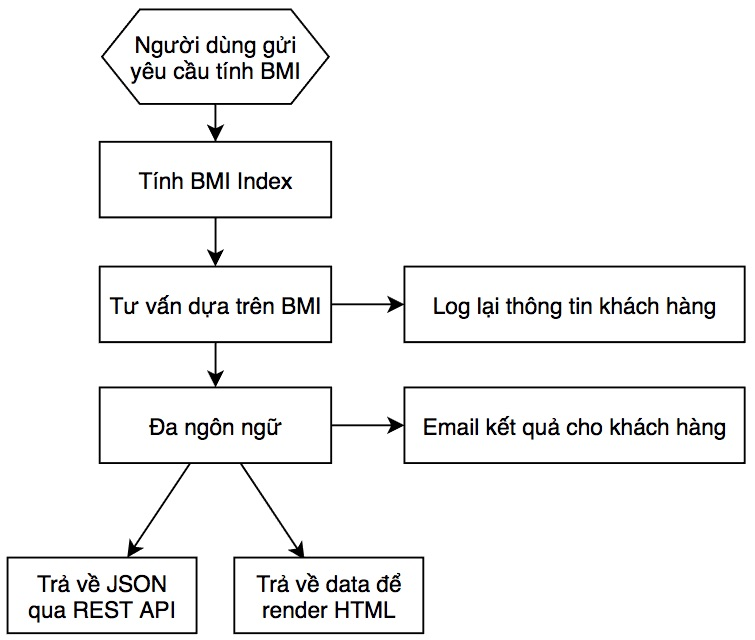
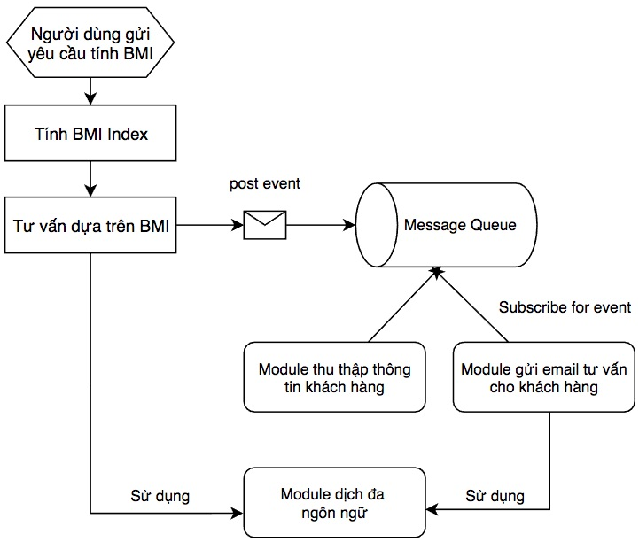

# Single Responsibity và Open / Close Principle 

## Refactor ứng dụng trợ lý ảo

Nhân sự kiện Zalo AI 2020 ra mắt ứng dụng trợ lý Kiki, trong khoá học CleanCode chúng ta cũng sẽ làm một ứng dụng trợ lý ảo đơn giản để rèn kỹ năng refactor, tái cấu trúc code.

**Chức năng ứng dụng trợ lý ảo này gồm có:**

1. Tính chỉ số Body Mass Index (BMI)
2. Chuyển đổi tiền tệ (Money Converter)
3. Dự báo thời tiết (Weather Forecast)



Ứng dụng này được viết bằng Java, Spring Boot. Các bạn có thể dùng Intellij community hoặc VSCode để lập trình. Cần cài bổ xung Java Extension Pack và Sppring Boot Extension Pack

**Các bước tôi thường làm khi phát triển phần mềm**

1. Thiết kế giao diện đẹp, chạy như thật demo cho khách hàng. Họ ưng, ký hợp đồng đã.
2. Code để chạy được những chức năng chính căn bản, tiếp tục cho khách hàng xem lấy ý kiến.
3. Refactor code để dễ mở rộng, dễ bảo trì
4. Dự án gia công thường giới hạn về thời gian và chi phí. Nếu khách hàng yêu cầu,bổ xung phần kiểm thử End to End Testing. Tôi thường không viết Unit Test vì các dự án khá gấp gáp, chức năng liên tục thay đổi.
5. Nếu team code lập trình viên DevOps thì nên cấu hình CI/CD ngay từ đầu để kiểm thử trên môi trường development 

# Các bước thực hành

## 1. BMIController.java

[BMIController.java](src/main/java/vn/techmaster/solid/controller/BMIController.java) có một phương thức 
```public String handleBMIForm(@ModelAttribute BMIRequest request, BindingResult bindingResult, Model model)```
làm rất nhiều chức năng:
  1. Hứng post request gửi tới địa chỉ ```/bmi```
  2. Parse request này, bind request.body vào đối tượng [BMIRequest.java](src/main/java/vn/techmaster/solid/request/BMIRequest.java), kết quả binding thì trả về ở tham số ```BindingResult bindingResult``
  3. Nếu không có lỗi thì tính toán chỉ số BMI, rồi trả về qua đối tượng [BMIResult](src/main/java/vn/techmaster/solid/response/BMIResult.java)

 Vấn đề của phương thức này là mặc dù nó không dài hơn 20 line, nhưng nó phức tạp trộn lẫn nhiều chức năng, kiểu, tham số, khác nhau. Rõ ràng là hàm tính chỉ số BMI rất đơn giản chỉ là Weight / (Height * Height) không liên quan đến giao diện, hay cơ sở dữ liệu. Vậy hãy tách nó ra để nó đứng độc lập, vừa dễ viết Unit Test vừa đáp ứng tiêu chí Single Resposibility trong SOLID

## 2. BMIController2.java
[BMIController2.java](src/main/java/vn/techmaster/solid/controller/BMIController2.java) đã chuyển logic tính BMI thành một hàm riêng. Cách này tốt hơn cách cũ nhưng vẫn có nhược điểm: nếu dự án sẽ cung cấp thêm RESTApi  thì logic tính BMI sẽ phải đặt ra ngoài controller, mới có thể tái sử dụng



## 3. BMIController3.java, BMIRest.java và HealthService.java: chuyển logic vào Service
Khách hàng yêu cầu cung cấp dịch vụ REST để phục vụ dữ liệu cho ứng dụng di động và Single Page App kiểu như React.js, Angular.js hay Vue.js.
Chúng ta tạo [BMIRest.java](src/main/java/vn/techmaster/solid/rest/BMIRest.java) hứng post request ở địa chỉ http://localhost:8080/api/bmi


Cả [BMIController3.java](src/main/java/vn/techmaster/solid/controller/BMIController3.java) và [BMIRest.java](src/main/java/vn/techmaster/solid/rest/BMIRest.java) đều gọi đến [HealthService.java](src/main/java/vn/techmaster/solid/service/HealthService.java)



Sử dụng POST Man để gửi POST request vào địa chỉ http://localhost:8080/api/bmi


## 4. Open for Extension but Close for Modification

Khách hàng yêu cầu hỗ trợ đa ngôn ngữ ứng dụng sang tiếng Anh, tiếng Nhật, rồi tiếng Hàn. Phiên bản tiếp theo sẽ yêu cầu lưu lại tất cả những thông tin người dùng gửi lên để sau đó bán gói tập gym
Hãy nhìn vào hàm này xem, làm thế nào bây giờ?

Mã nguồn hàm tính BMI đây nhé.

```java
public BMIResult calculateBMI(BMIRequest request) {
    float bmiIndex = request.getWeight() / (request.getHeight() * request.getHeight());
      String category;
      if (bmiIndex < 15) {
        category = "Ốm đói";
      } else if (bmiIndex < 16) {
        category = "Rất gầy";
      } else if (bmiIndex < 18.5) {
        category = "Thiếu cân";
      } else if (bmiIndex < 25) {
        category = "Chuẩn mực";
      } else if (bmiIndex < 30) {
        category = "Hơi béo";
      } else if (bmiIndex < 35) {
        category = "Rất béo";
      } else if (bmiIndex < 40) {
        category = "Khủng long";
      } else {
        category = "Gọi cần cẩu";
      }
      return new BMIResult(bmiIndex, category,"");
  }
```

Rõ ràng là chức năng đa ngôn ngữ và tư vấn chế độ tập luyện cho người dùng cần phải tách ra, mở rộng, liên tục thay đổi nghiệp vụ. Như vậy từ một hàm tính BMI rất đơn giản, yêu cầu ngày càng rối rắm và phức tạp. Chúng ta học tiếp nguyên lý Open/Close "Open for extension but Close for modification".

Giải thích nguyên lý này như sau: Hãy thiết kế phần mềm để dễ dàng mở rộng, ghép nối thêm module mới, nhưng không phải tháo tung các module hiện có đập đi, làm lại. Để dễ hình dung nếu bạn làm mới một con đường đi qua vùng đất không có nhà cửa, cư dân ở thì chi phí giải phóng mặt bằng thi công sẽ thấp, dễ dàng hơn làm đường đi xuyên qua khu dân cư. Vậy khi thiết kế khu dân cư cần hình dung trong tương lai những vấn đề sau:

1. Số lượng dân cư sẽ tăng lên nhanh chóng
2. Nhu cầu sử dụng xe ô tô sẽ trở nên phổ biến áp đảo so với xe máy, cần thêm chỗ để xe, các làn đường cao tốc cho xe chạy.

Trong khu dân cư, sẽ có những không gian xanh, công viên, hồ nước. Khi nhu cầu mở rộng đường, cao ốc, những không gian xanh này rất dễ bị tận dụng vì nó là của chung, chi phí đền bù thấp. Tuy nhiên nếu lạm dụng sẽ gây nên mất mát lớn về môi trường trong tương lai.

Thiết kế phần mềm cũng như thiết kế quy hoạch đô thị: **Dễ dàng mở rộng và ít đập phá nhất !**

### Những hướng giải quyết để đạt tiêu chí Open/Close
1. Viết hàm tính BMI Index chỉ tập trung trả về chỉ số BMI, không chứa thêm bất kỳ chức năng nào khác.
2. Viết hàm nhận xét theo tham số vào BMI Index độc lập khỏi chức năng đa ngôn ngữ.
3. Chức năng dịch đa ngôn ngữ rõ ràng sẽ ứng dụng ở nhiều nơi khác nhau ví dụ chức năng dự báo thời tiết, chuyển đổi tiền tệ...

Khi hàm đã tối giản, chỉ làm một việc duy nhất. Thì xác suất chúng phải sửa đổi lại trong tương lai ít đi nhiều. Vậy đã đáp ứng được yêu cầu Close For Modification.

Đễ dễ dàng mở rộng, chúng ta dùng các kỹ thuật sau đây:

1. Sử dụng OOP Interface, Generics
2. Sử dụng lập trình hướng sự kiện Event Based Programming cụ thể Message Queue. Các thành phần không gọi nhau trực tiếp mà trao đổi với nhau qua message. Thành phần nào quan tâm thì đăng ký nhận bản tin sự kiện (Subscribe for notification).

Đây là ví dụ một Tight Coupling Workflow (một chu trình ràng buộc lẫn nhau giữa các component quá lớn)



Sử dụng phương pháp truyền thông điệp (publish - subscribe)

Publish - subscribe sẽ tách các tác vụ có thời gian thực thi, tốc độ thực thi chênh lệch nhau, không nhất thiết phải đồng bộ cùng chạy.
Ví dụ khi người dùng gửi lên thông tin cân nặng, chiều cao, server cần phải trả về sớm nhất có thể chỉ số BMI Index, đánh giá sơ bộ. Còn email mời tham dự gói tập gym có thể để 30 phút thậm chí 1 ngày sau mới gửi. Việc gửi email lỗi cũng không nên ảnh hưởng đến kết quả trả về.

Cách dùng publish - subscribe cho phép bổ xung thêm các dịch vụ vệ tinh subscribe sự kiện gửi ra (Open for Extension) mà không cần phải sửa đổi code của module tạo ra sự kiện (Close for Modification).

### Ví dụ khác về Open/Close: Photoshop
Phần mềm Photoshop, trước 2010, người dùng chỉ có lựa chọn lưu ra ổ cứng vật lý trong máy tính hoặc mạng cục bộ. Sau 2010, có thêm các dịch vụ lưu trữ trên đám mây, việc thêm chức năng lưu trữ trên mây cần không ảnh hưởng nhiều đến chức chỉnh sửa ảnh hay kể cả chức năng lưu ra ổ cứng vật lý (Open for Modification).

Các plugin tạo hiệu ứng lọc ảnh (filter plugin) được viết bởi hãng thứ 3, contributor. Hãng thứ 3, contributor sẽ không được xem code chi tiết của Photoshop mà chỉ cần tuân thủ một số cấu trúc dữ liệu (mảng hai chiều chứa thông tin điểm ảnh) nhận vào và trả về.

Photoshop cũng không cần quan tâm đến code bên trong của plugin.


### Ví dụ khác về Open/Close: phần mềm phân tích giọng nói, và tổng hợp tiếng nói.

Web site trợ lý ảo version 1.0 ra mắt thành công. Giờ khách hàng muốn không phải gõ bàn phím mà dùng giọng nói để giao tiếp với máy tính.

Khách hàng nói "Tôi nặng một phẩy bẩy sáu mét, nặng bảy mươi tư cân, tư vấn chế độ tập đi".

Ứng dụng trả lời "Chỉ số BMI của anh hiện là 2.67, anh ổn nhưng nếu anh đi tập thêm Kick Fit để có bụng 6 múi thì sẽ đẹp hơn đó anh. Bên em đang có chương trình khuyến mãi chào xuân 2021, giảm 30% phí thành viên. Em gửi thông tin chi tiết cho anh vào email. Anh check mail để lấy coupon nhé".

Từ một ứng dụng tính BMI cực đơn giản nay đã trở thành trợ lý tư vấn sức khoẻ, bán hàng cực ngon. Vấn đề team phát triển của chúng ta rất yếu về AI, xử lý tiếng nói. Chúng ta quyết định thuê bao dịch vụ nhận dạng tiếng nói (voice recognition) và tạo tiếng nói (voice synthesis). Hai dịch vụ này phải trả phí theo thời gian sử dụng, rõ ràng là nhà cung cấp kiếm bộn tiền và họ không thể mở mã nguồn --> Close for modification. Tuy nhiên, họ vẫn mở API để chúng ta gọi vào sử dụng nhưng vậy là Open for extension.

### Kết luận với chiến thuật Open/Close

**Nếu lập trình hướng đối tượng:**

1. Sử dụng tính chất Encapsulation, càng che dấu những thuộc tính, phương thức riêng càng nhiều càng tốt. Close for modification.
2. Sử dụng getter/setter method chứ không khai báo thuộc tính public. Close for modification.
3. Sử dụng abstract class, interface, để khi cần mở rộng thì kế thừa, tuân thủ, viết đè chứ không sửa, thêm trực tiếp vào logic có sẵn. Open for extension
4. Sử dụng generics để dùng chung thuật toán cho nhiều kiểu dữ liệu. Open for different types of data structure but close for algorithm modification.
5. Refactor lại class, method để đạt tiêu chí Single Responsibility (mỗi hàm một việc). Mức độ Single Responsibility càng cao, thì khả năng tái sử dụng cũng tăng và giảm tỷ lệ sửa đổi, cập nhật xuống. (Reduce modification chứ không hẳn close for modification).
6. Ưu tiên Compose over Inheritance (Gom nhiều thành phần hơn là kế thừa) cũng có ảnh hưởng tích cực đến Open/Close.
7. Hình dung và định nghĩa tốt public interface đủ để đáp ứng cho thay đổi trong tương lai. Việc này tương tự như trù tính dôi dư quỹ đất để làm đường, tiện ích công cộng khi quy hoạch đô thị.

**Nếu kiến trúc một hệ thống phức tạp, microservice, distributed transaction**
1. Giảm bớt lời gọi trực tiếp remote procedure calling: request - response, mà thay bằng cơ chế publish - subscribe, message queue
2. Chia tách database (split database) để giảm bớt quan hệ ràng buộc primary key - foreign key đôi khi phải hy sinh đặc tính consistency trong ACID (atomicity, consistency, isolation, durability) để đổi lấy scalability.


